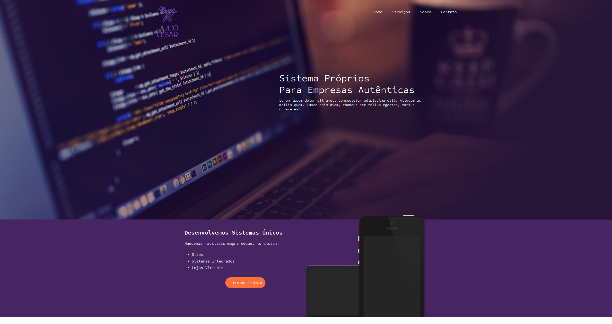

# Landing Page 

Este é um exemplo simples de uma landing page criada com HTML e CSS para apresentar uma empresa fictícia e seus serviços. Este README fornece uma visão geral do código e de sua estrutura.

## Estrutura de Arquivos

A estrutura de arquivos deste projeto é organizada da seguinte forma:

- `index.html`: O arquivo HTML principal que define a estrutura da página de destino.
- `style.css`: O arquivo CSS para estilizar a página.
- `images/`: Uma pasta de imagens usadas na página.

## Ainda está em construção

